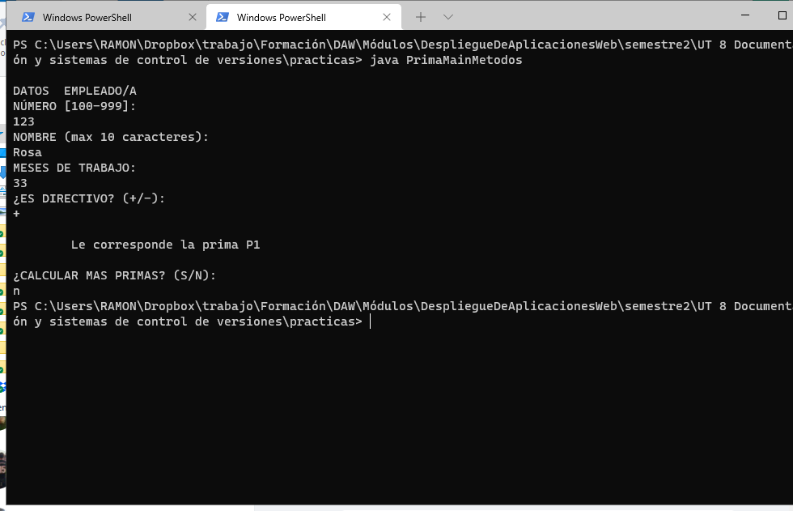

# prima

## Autor

Ramón García (Avilés), estudiante del Ciclo formativo de Grado Superior en Desarrollo de Aplicaciones Web. Puedes conocer más de mis proyectos visitando mi perfil en GitHub: [@ramongm20](https://github.com/ramongm20).

## Descripción del programa

Esta liviana aplicación accesible a través de línea de comandos ofrece una manera rápida de calcular la prima correspondiente al personal de una empresa. Para ello tiene en cuenta tanto la antigüedadd como la responsabilidad del puesto de trabajo.  

## Tecnologías implementadas

La aplicación se ha desarrollado en Java con Eclipse, y la documentación se ha generado utilizando Javadoc, que es así mismo una herramienta incluída en el Kit de Desarrollo de java.

## Contenido del repositorio

- *doc*, carpeta con la documentación del proyecto.
- *captura.png*, imagen que acompaña esta entrada.
- *PrimaMainMetodos.java*, código fuente del programa.

## Finalidad del repositorio

Lo que se ha pretendido con el presente trabajo es mostrar la capacidad de generar **documentación** útil para el uso y mantenimiento de código, y el conocimiento de herramientas tales como **Github** para compartir dicho trabajo con otras personas.

